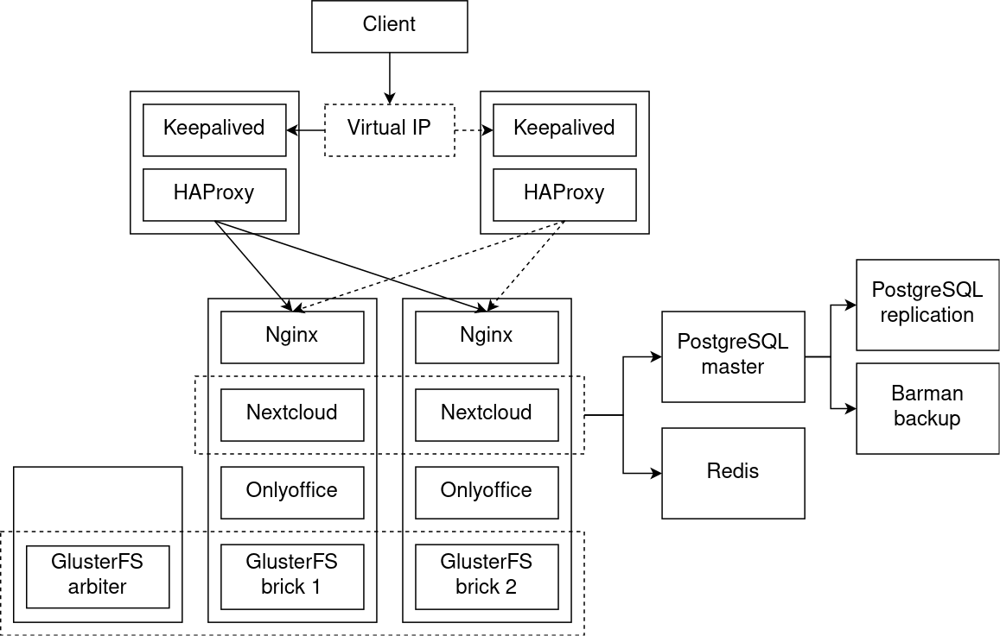
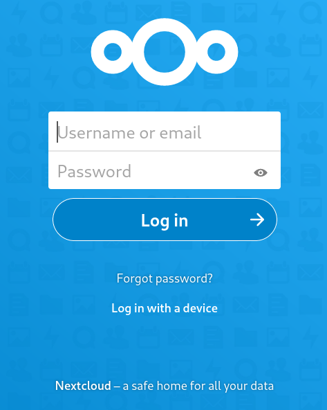
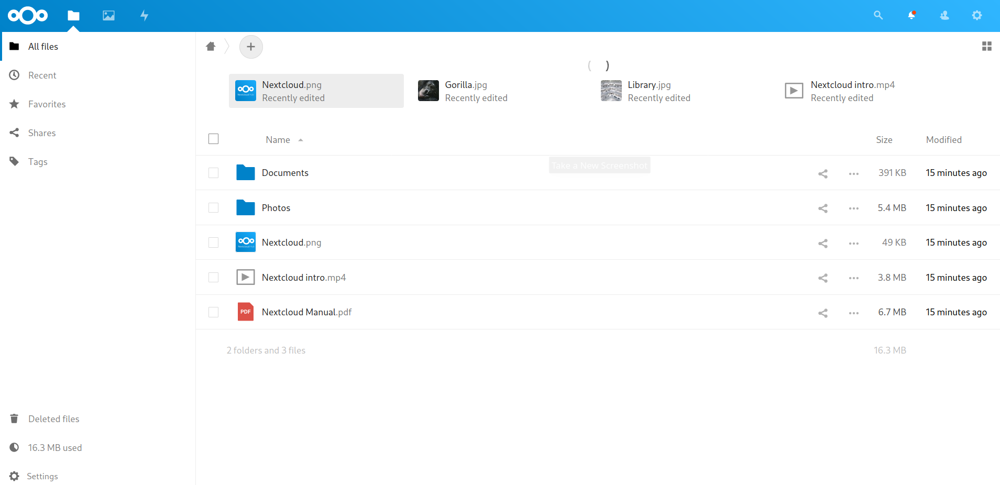
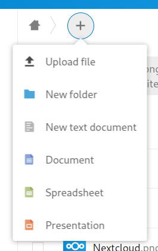

# Итоговый проект по курсу «Администратор Linux»  <!-- omit in toc -->

- [Описание проекта](#описание-проекта)
  - [Общая информация](#общая-информация)
  - [Образ решения](#образ-решения)
  - [Схема проекта](#схема-проекта)
- [Запуск и настройка проекта](#запуск-и-настройка-проекта)
- [Проверка работоспособности](#проверка-работоспособности)
- [Переключение на реплику](#переключение-на-реплику)
- [Ссылки](#ссылки)
  - [Nextcloud](#nextcloud)
  - [ONLYOFFICE](#onlyoffice)
  - [Интеграция Nextcloud и ONLYOFFICE](#интеграция-nextcloud-и-onlyoffice)

## Описание проекта

### Общая информация

Проект представляет собой отказоустойчивое облачное хранилище Nextcloud с интегрированным сервером офисных приложений ONLYOFFICE.

Для разворачивания проекта используется Vagrant и Ansible.

### Образ решения

На основном сервере в docker-контейнерах располагаются Nextcloud, документ-сервер ONLYOFFICE и Nginx в качестве обратного прокси. В целях отказоустойчивости данный сервер продулирован, и в теории копий сервера может быть сколько угодно.

Балансировку нагрузки на эти серверы осуществляет HAProxy, также расположенный на двух серверах. Отказоустойчивость серверов HAProxy обеспечивает Keepalived с настроенным виртуальным IP-адресом.

В качестве общего хранилища данных используется распределённая файловая система GlusterFS, развёрнутая на этих же серверах. Для исключения ситуации split-brain поднята отдельная машина в качестве арбитра.

Для обеих копий Nextcloud используется общая база данных PostgreSQL, развёрнутая на отдельном сервере. Для БД настроены потоковая репликация и снятие бэкапов посредством Barman.

Также для обеих копий Nextcloud используется общий сервер с Redis.

### Схема проекта



## Запуск и настройка проекта

1. Выполнить в каталоге с проектом команду `vagrant up`.
2. После того, как все машины будут подняты и настроены, необходимо настроить GlusterFS. Для этого нужно:
   - закомментировать все роли, кроме [glusterfs-create](provisioning/roles/glusterfs-create), в следующих плейбуках:
     - [web-first.yml](provisioning/playbooks/web-first.yml);
     - [web-replica.yml](provisioning/playbooks/web-replica.yml);
     - [arbiter.yml](provisioning/playbooks/arbiter.yml);
   - сохранить эти плейбуки;
   - выполнить команду: `vagrant provision web{1,2} arbiter`.

    Пример плейбука для этого шага:

    ```yml
    ---
    - hosts: all
      roles:
        # - docker
        # - glusterfs-install
        - glusterfs-create
        # - nextcloud-replica
    ```

3. Развернуть Nextcloud на одном из серверов. Для этого необходимо в плейбуке [web-first.yml](provisioning/playbooks/web-first.yml) закомментировать все роли, кроме [nextcloud](provisioning/roles/nextcloud), и выполнить команду:

    ```console
    vagrant provision web1
    ```

    После того, как Ansible закончит настройку, необходимо дождаться старта сервисов (5–10 минут, в зависимости от производительности диска). Чтобы убедится, что сервис готов к работе, лучше всего зайти на виртуальную машину командой `vagrant ssh web1`, перейти в каталог с файлами проекта **/opt/nextcloud** и от имени суперпользователя выполнить команду `docker-compose logs -f` для просмотра логов. Сервис будет готов к работе, когда в выводе появится строчка `NOTICE: ready to handle connections` напротив `app-server`.

4. Добавить интеграцию с ONLYOFFICE. Для этого на сервере web1 от имени суперпользователя необходимо выполнить скрипт [set_configuration.sh](provisioning/roles/nextcloud/files/set_configuration.sh).
5. Развернуть второй экземпляр Nextcloud. Для этого необходимо в плейбуке [web-replica.yml](provisioning/playbooks/web-replica.yml) закомментировать все роли, кроме [nextcloud-replica](provisioning/roles/nextcloud-replica), и выполнить команду:

    ```console
    vagrant provision web2
    ```

    Поскольку все необходимые файлы уже созданы, старт приложений пройдёт быстрее. Готовность приложения можно отслеживать так же, как и при разворачивании первого экземпляра Nextcloud.

## Проверка работоспособности

Чтобы убедится, что проект работает, необходимо в браузере перейти на страницу с виртуальным IP-адресом: http://10.10.10.10/. Должна открыться стартовая страница Nextcloud:



Войти в Nextcloud, используя логин `admin` и пароль `adminpassword` (задаются в переменных окружения для docker-compose, могут быть изменены в файле [app_cred.env.j2](provisioning/roles/nextcloud/templates/app_cred.env.j2)):



Интеграцию с ONLYOFFICE можно проверить, создав файл из выпадающего меню:



## Переключение на реплику

В случае, если основной сервер PostgreSQL станет недоступным, для продолжения работы можно переключиться на реплику. Для этого в файле **recovery.conf** на ведомом сервере необходимо добавить строчку с описанием файла для переключения и перезапустить сервис PostgreSQL, чтобы изменения вступили в силу:

```
trigger_file = '/tmp/to_master'
```

Теперь при падении основного сервера достаточно создать файл, указанный в **recovery.conf**, и реплика станет новым мастером, готовым обрабатывать обращения, в том числе на запись:

```console
# touch /tmp/to_master
```

Также нужно переключить на этот сервер обе копии Nextcloud. Для этого в файле **/opt/nextcloud/app.env** необходимо указать в переменной `POSTGRES_HOST` IP-адрес нового мастера и перезапустить Nextcloud:

```console
# docker-compose up -d
```

## Ссылки

### Nextcloud

Сайт проекта: https://nextcloud.com/

Github: https://github.com/nextcloud/server

Docker Hub: https://hub.docker.com/_/nextcloud

Github-аккаунт для docker-версии: https://github.com/nextcloud/docker

Документация: https://docs.nextcloud.com/server/19/admin_manual/

### ONLYOFFICE

Сайт проекта: https://www.onlyoffice.com/

Github: https://github.com/ONLYOFFICE/DocumentServer

Docker Hub: https://hub.docker.com/r/onlyoffice/documentserver/

Документация: https://helpcenter.onlyoffice.com/

### Интеграция Nextcloud и ONLYOFFICE

https://github.com/ONLYOFFICE/docker-onlyoffice-nextcloud
